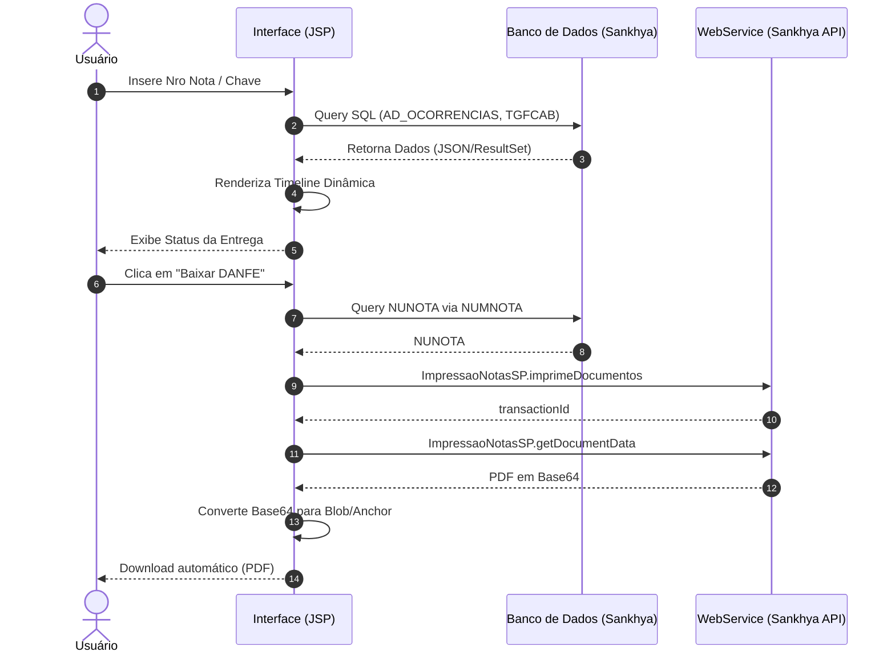

# Documentação do Projeto: Rastreamento de Entregas (Sankhya)

Bem-vindo à documentação oficial da **Tela de Rastreamento de Entregas**, uma solução elegante e responsiva para acompanhamento de pedidos e notas fiscais integrada ao ERP Sankhya.

---

## 📌 Infográfico: Visão Geral do Sistema (NotebookLM Ready)

````carousel
> [!TIP]
> **1. Busca Inteligente**
> A interface permite buscar notas fiscais por Número da Nota ou Chave de Acesso (NFe/CTe). A busca valida os dados e aciona consultas diretas no banco de dados do Sankhya.

<!-- slide -->
> [!NOTE]
> **2. Timeline Interativa**
> O coração da aplicação é a linha do tempo. Ela exibe os eventos de transporte (Ocorrências) cronologicamente, com ícones dinâmicos, cores baseadas no status (Entregue, Pendente, etc.) e detalhes ricos como assinaturas e fotos.

<!-- slide -->
> [!IMPORTANT]
> **3. Download de DANFE Nativo**
> O sistema implementa um fluxo nativo e robusto para download do DANFE. Ele se comunica com a API interna do Sankhya para gerar o PDF em Base64 e forçar o download diretamente pelo navegador do usuário.
````

---

## 🏗️ Arquitetura e Fluxo de Dados (Walkthrough)

O fluxo principal do usuário na aplicação se divide em três etapas críticas: **Busca**, **Renderização do Rastreio** e **Download do Documento (DANFE)**.



---

## 🔍 Detalhes Técnicos da Implementação

### 1. Interface e Estilização (CSS Variables & Glassmorphism)
A interface foi desenhada visando uma experiência "Premium", sem o uso de frameworks pesados de CSS. Foi empregado:
- **Variáveis CSS Root**: Padronização de cores, espaçamentos e sombras (`--brand`, `--page-bg`, `--surface`, etc.).
- **Responsividade Flexbox**: Componentes como `search-card` e `timeline` se adaptam desde dispositivos mobile até painéis desktop.
- **Micro-interações**: Hover states dinâmicos com transformação (`translateY`), cursores personalizados e `spinners` durante requisições.

### 2. Histórico Pessoal (Consultas Rápidas)
Sempre que um usuário (logado via `CODUSU`) acessa uma nota, o sistema salva esse acesso na tabela `AD_HISTRASTENTOCOR` via serviço padrão `DatasetSP.save`. O menu de acesso rápido "Histórico" carrega as últimas 5 buscas, facilitando a navegação de usuários recorrentes.

### 3. Integração com WebService (Sankhya Link)
O tráfego de dados com o Sankhya é abstraído pela função customizada `callSankhyaService(serviceName, url, requestBody)`, que gerencia a comunicação `fetch()`, converte a string XML/JSON em objetos úteis e faz parse do retorno nativo do JSP.

---

## 🔌 API Swagger / OpenAPI (Endpoints Integrados)

Para viabilizar a arquitetura, o sistema interage com serviços nativos do Sankhya. Abaixo, uma modelagem em Swagger (OpenAPI 3.0) ilustrando os contratos utilizados pela tela para emissão do DANFE:

```yaml
openapi: 3.0.0
info:
  title: Sankhya Document Printing API (Integration View)
  description: Endpoints do Sankhya utilizados pela tela de rastreamento para emitir e baixar o DANFE.
  version: "1.0"
servers:
  - url: https://{sankhya_domain}/mgecom/service.sbr
    description: Sankhya MGECOM Service
paths:
  /imprimeDocumentos:
    post:
      summary: Gera o documento fiscal para impressão
      description: Inicia a transação de geração de um documento (DANFE) no servidor com base no NUNOTA.
      parameters:
        - name: serviceName
          in: query
          required: true
          schema:
            type: string
            example: ImpressaoNotasSP.imprimeDocumentos
      requestBody:
        required: true
        content:
          application/json:
            schema:
              type: object
              properties:
                notas:
                  type: object
                  properties:
                    gerarpdf:
                      type: boolean
                      example: true
                    nota:
                      type: array
                      items:
                        type: object
                        properties:
                          nuNota:
                            type: integer
                          fileName:
                            type: string
      responses:
        '200':
          description: Transação de impressão iniciada
          content:
            application/json:
              schema:
                type: object
                properties:
                  transactionId:
                    type: string
                    example: "5117DA9B3D16C3728DC4B299D0917B4B"
                    
  /getDocumentData:
    post:
      summary: Recupera os dados codificados do documento gerado
      description: Obtém o documento fiscal (PDF em Base64) atrelado à transação e NUNOTA informados.
      parameters:
        - name: serviceName
          in: query
          required: true
          schema:
            type: string
            example: ImpressaoNotasSP.getDocumentData
      requestBody:
        required: true
        content:
          application/json:
            schema:
              type: object
              properties:
                params:
                  type: object
                  properties:
                    NUNOTA:
                      type: integer
                    FILENAME:
                      type: string
      responses:
        '200':
          description: Documento retornado com sucesso
          content:
            application/json:
              schema:
                type: object
                properties:
                  responseBody:
                    type: object
                    properties:
                      PDF:
                        type: string
                        description: Data URI do arquivo PDF (Base64)
                        example: "data:application/pdf;base64,JVBERi0xLjQK..."
```

---

> [!TIP]
> **Pronto para o Portfólio!** 
> Você pode extrair os trechos de código YAML (Swagger), o diagrama Mermaid e os infográficos estruturados com blocos para alimentar o seu currículo, GitHub ou NotebookLM. O arquivo atual reflete práticas avançadas de integração de APIs e UX moderna.
